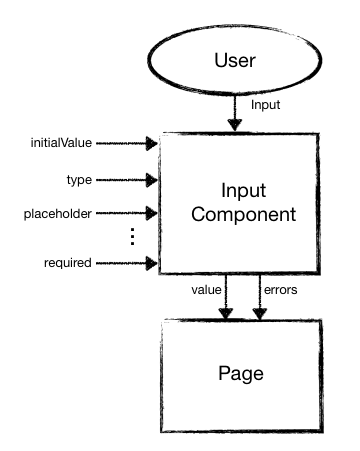

# Input Componentization

## What is the objective of the project?
Create an input component that receive values such as type, placeholder and initialValue, creates an input field based on those parameters and then return the value and errors whenever there is a change on the field.

## Why should I use this concept?
1. Maintainability and reuse 
Since all the code regarding inputs is in the same place it's much easier to maintain and edit your code. One change affects the whole code. This way it is much easier to fix bugs and you ensure that once a bug is fixed the same bug won't pop out elsewhere(if you repeat the type of an input a lot it's pretty common to forget to fix the bug somewhere).

2. Low coupling 
As long as you always return the value of the input and which errors it contain, doesn't matter how you implement it. Suppose you are using Ionic w/ Angular and you want to change from ion-input to mat-input, if you are using this concept you only need to make a single change.

## When should I use this concept?
1. Big projects or medium/small project with a high number of inputs.

## When should I not use this concept?
1. Medium/small project with a low number of inputs.

## How to see a demo of this project?
1. Open either the 'angular' or the 'ionic' folder of this project in the terminal/bash.
2. Run 'npm install'.

### If you selected 'angular'
3. Run 'ng serve'.
4. Open 'localhost:4200' at your browser.

### If you selected 'ionic'
3. Run 'ionic serve'.
4. Open 'localhost:8100' at your browser.
